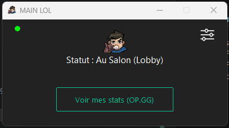
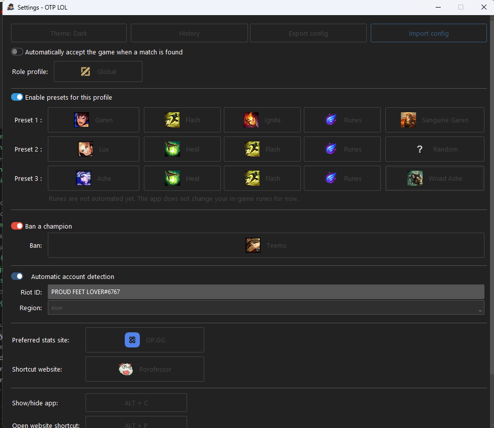
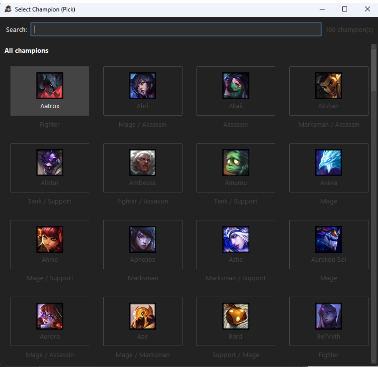

# MAIN LOL

Windows desktop assistant for League of Legends, written in Python.

`MAIN LOL` automates several actions around the LoL client to save time during queue, champion select, and post-game, while keeping the interface simple to configure.

Current project version: `7.0`

## Table Of Contents

- [Overview](#overview)
- [Features](#features)
- [Screenshots](#screenshots)
- [Technologies](#technologies)
- [Requirements](#requirements)
- [Installation From Source](#installation-from-source)
- [Launch](#launch)
- [Executable Build](#executable-build)
- [Configuration And Used Files](#configuration-and-used-files)
- [Usage](#usage)
- [Shortcuts](#shortcuts)
- [Project Architecture](#project-architecture)
- [Tests And Verification](#tests-and-verification)
- [Troubleshooting](#troubleshooting)
- [Possible Roadmap](#possible-roadmap)

## Overview

The goal of the application is to act as a local assistant for the League of Legends client.

It connects to the LoL client through the LCU, detects important phases, then automatically performs certain actions depending on your configuration:

- automatically accept a match
- preselect or lock a champion according to a priority order
- ban a selected champion
- apply summoner spells
- start another match after the game ends
- quickly open external pages such as `OP.GG` and `Porofessor`

The application is designed to work as a lightweight desktop tool:

- Tkinter graphical interface through `ttkbootstrap`
- local asset management
- system tray support
- keyboard shortcuts
- local cache for some Data Dragon data

## Features

### Queue And Champion Select Automation

- `Auto-Accept`
  Automatically accepts the ready check when a match is found.
- `Auto-Pick`
  Tries to pick `Pick 1`, then `Pick 2`, then `Pick 3` if the previous champion is not available.
- `Pre-hover`
  The application can preselect your main champion before locking it.
- `Auto-Ban`
  Automatically bans the configured champion.
- `Auto-Spells`
  Applies the selected spells once the pick is locked.

### Post-Game Automation

- `Auto Play Again`
  Attempts to automatically return to the lobby after the game ends.

### Quality-Of-Life Features

- automatic account detection
- automatic client region detection
- quick links to several player and in-game stats websites
- option to hide the window in the system tray
- configurable global keyboard shortcuts
- champion and spell icon cache
- logs in `%APPDATA%`

### Safety / Robustness Behaviors

The project now includes several useful safeguards:

- separation between `manual_*` and `auto_detected_*` values
- cleaner application shutdown
- visual fallback if the system tray or hotkeys are not available
- semantic version comparison for update detection

## Screenshots

### Main Window



### Settings Window



### During Champion Select



## Technologies

The project mainly uses:

- `Python 3.13`
- `ttkbootstrap` for the interface
- `tkinter` for the UI base
- `lcu-driver` to communicate with the League of Legends client
- `Pillow` for images
- `pygame` for sound effects
- `pystray` for the system tray
- `keyboard` for global shortcuts
- `requests` for Data Dragon and GitHub

## Requirements

Before running the project from source, you need:

- Windows
- Python `3.13`
- `pip`
- the League of Legends client installed

## Installation From Source

```bash
git clone https://github.com/qurnt1/main_lol_2.git
cd MAIN_LOL
pip install -r requirements.txt
```

## Launch

To run the application locally:

```bash
python launcher.py
```

On startup, the application:

1. checks that only one instance is running
2. loads local settings
3. prepares cache folders
4. starts the interface
5. initializes the connection to the LoL client
6. loads Data Dragon in the background

## Executable Build

The project provides a PyInstaller build script:

```bash
python create_exe.py
```

This script generates a portable executable:

- binary name: `OTP LOL.exe`
- final location: project root

The script also handles:

- asset inclusion
- `src` package inclusion
- several hidden imports for PyInstaller
- cleanup of temporary build folders

## Configuration And Used Files

### User Files

- Settings:
  `%APPDATA%\MainLoL\parameters.json`
- Logs:
  `%APPDATA%\MainLoL\app_debug.log`

### Local Cache

- Champion cache:
  `%TEMP%\mainlol_ddragon_champions.json`
- Champion icon cache:
  `%TEMP%\mainlol_icons\`
- Spell icon cache:
  `%TEMP%\mainlol_spells\`

### Main Settings

The application stores, among other things:

- automation toggles
- picks `1 / 2 / 3`
- configured ban
- summoner spells
- automatic detection mode
- manual account and region values
- auto-detected account and region values

## Usage

### First Launch

On first launch, you can:

1. open the settings through the gear icon
2. choose your priority picks
3. choose your ban
4. configure spells
5. decide whether you want automatic account detection
6. enable or disable automatic return to lobby

### Automatic Detection Or Manual Mode

The application now distinguishes between:

- manual values
- values automatically detected by the LoL client

This prevents automatic detection from overwriting your manual account or region.

### Behavior During The Game

When the client is detected:

- the connection indicator turns green
- the application can hide itself automatically
- it follows client phase changes

During champion select:

- it detects your actions
- it attempts to hover
- it tries to lock the best available pick according to the configured order
- it applies spells if the option is enabled

After the game:

- it can automatically attempt `Play Again` if the option is enabled

## Shortcuts

Shortcuts are configurable from the settings.

Default values:

- `Alt + P`
  Opens the configured in-game website
- `Alt + C`
  Shows or hides the main window

## Project Architecture

```text
MAIN_LOL/
|-- launcher.py
|-- create_exe.py
|-- requirements.txt
|-- readme.md
|-- src/
|   |-- __init__.py
|   |-- config/
|   |-- core/
|   |-- services/
|   |-- ui/
|   `-- utils.py
|-- config/
|   |-- son.wav
|   `-- images/
`-- tests/
    |-- test_config.py
    |-- test_core_champ_select.py
    |-- test_history.py
    |-- test_ui_settings.py
    `-- test_utils.py
```

### Role Of Main Files

- `launcher.py`
  Main entry point and lifecycle orchestration.
- `src/config/`
  Constants, paths, version, default settings, and config file handling.
- `src/core/`
  Business logic, Data Dragon, WebSocket / LCU, and game automations.
- `src/services/`
  External URLs, history, updates, DPI, and single-instance handling.
- `src/ui/`
  Graphical interface, system tray, toasts, shortcuts, and user interaction handling.
- `src/utils.py`
  Utility functions: lockfile, external URLs, update check, DPI.
- `create_exe.py`
  Windows build through PyInstaller.

## Tests And Verification

The project contains regression tests for:

- configuration handling
- utilities
- some branches of the champion select logic

To run the tests:

```bash
python -m unittest discover -s tests -v
```

To quickly verify that the code compiles:

```bash
python -m compileall launcher.py src create_exe.py tests
```

## Troubleshooting

### The Application Does Not Detect LoL

Check that:

- the League of Legends client is running
- `lcu-driver` is properly installed
- the application is running on the same machine as the LoL client

### The System Tray Or Hotkeys Do Not Work

The application now has a fallback:

- a `Quit` button remains visible if the system tray or shortcuts are not available

### Images Or Icons Do Not Load

Check that this folder exists:

```text
config/
`-- images/
```

### Logs

If something goes wrong, the first file to check is:

```text
%APPDATA%\MainLoL\app_debug.log
```

## Possible Roadmap

Some ideas for future improvements:

- profiles by role
- profiles by game mode
- automatic action history
- better screenshots in the README
- more visual presentation page
- profile import / export

## Author

Project maintained by `Qurnt1`.
