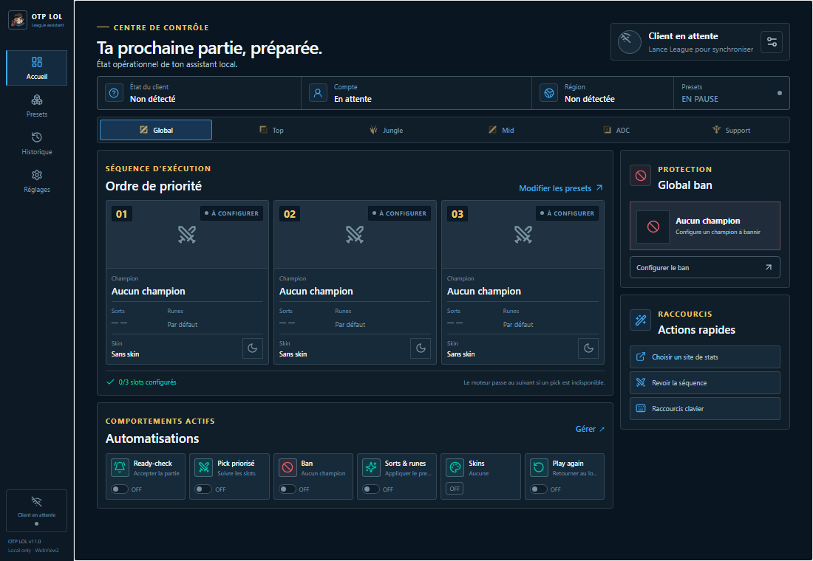
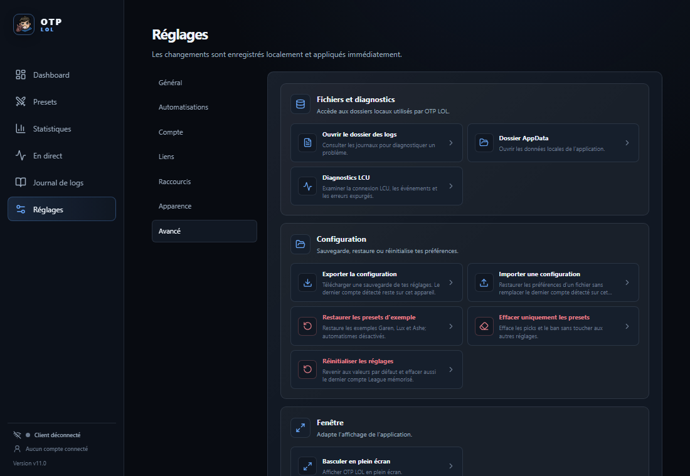

<p align="center">
  <a href="./readme.md"></a>
  <a href="./requirements.txt"></a>
  <a href="https://www.leagueoflegends.com/"></a>
  <a href="./readme.md"></a>
</p>

---

<h1 align="center">OTP LOL</h1>

---

Windows desktop assistant for League of Legends, written in Python.

`OTP LOL` automates several actions around the LoL client to save time during queue, champion select, and post-game, while keeping the interface simple to configure.

Current project version: `11.0`

## Table Of Contents

- [Overview](#overview)
- [Version 11.0 Highlights](#version-110-highlights)
- [Features](#features)
- [Screenshots](#screenshots)
- [Technologies](#technologies)
- [Requirements](#requirements)
- [Installation From Source](#installation-from-source)
- [Launch](#launch)
- [Executable Build](#executable-build)
- [Configuration And Used Files](#configuration-and-used-files)
- [Usage](#usage)
- [Shortcuts](#shortcuts)
- [Project Architecture](#project-architecture)
- [Tests And Verification](#tests-and-verification)
- [Documentation](#documentation)
- [Troubleshooting](#troubleshooting)
- [Possible Roadmap](#possible-roadmap)

## Overview

The goal of the application is to act as a local assistant for the League of Legends client.

It connects to the LoL client through the LCU, detects important phases, then automatically performs certain actions depending on your configuration:

- automatically accept a match
- pre-pick and lock a champion according to a preset priority order
- ban a selected champion
- apply preset-based summs
- start another match after the game ends
- quickly open external pages such as `OP.GG` and `Porofessor`

The application is designed to work as a lightweight desktop tool:

- React graphical interface hosted in a native `pywebview` window
- local asset management
- system tray support
- keyboard shortcuts
- local cache for some Data Dragon data

## Version 11.0 Highlights

Version `11.0` focuses on preset completeness: skins, summoner spells, rune pages, and release/update behavior now work together more reliably.

- `Rune page automation`
  Presets can now store a League rune page and apply it automatically during champion select. The app confirms the selected rune page through the LCU and retries when the client overwrites state.

- `Rune picker with full previews`
  The settings window now shows every selected rune in the rune picker: primary runes, secondary style, secondary runes, and stat shards. Rows are fully clickable, rune icons come from CommunityDragon, and tooltips expose rune names for easier inspection.

- `Compact rune previews in settings`
  Preset rune buttons now show a compact main-rune plus secondary-style preview, and clearly flag presets where rune auto-apply is disabled.

- `Skin inventory detection and validation`
  The app now resolves owned skins more reliably, logs inventory and pickable-skin fallbacks more clearly, and validates fixed skins against the skins that are actually pickable in champion select.

- `Reworked skin picker`
  The settings window now exposes a cleaner skin picker with direct `fixed` or `random list` selection, centered skin art in the picker, tile previews in settings, and confirmation when a skin is not detected on the current account.

- `Per-preset skin modes`
  Every preset uses the same three skin modes in Presets and Dashboard: `none`, `fixed`, and `random`. There is no inherited mode or global skin override.

- `Cleaner startup and runtime output`
  Audio initialization no longer pollutes startup output, temporary rune debug prints were removed, and noisy rune retry logs were moved to debug-level logging.

## Features

### Queue And Champion Select Automation

- `Auto-Accept`
  Automatically accepts the ready check when a match is found.
- `Preset Priority`
  Tries `Preset 1`, then `Preset 2`, then `Preset 3` if the previous preset champion is unavailable or banned.
- `Pre-pick`
  The application can preselect your priority champion before the actual lock phase.
- `Auto-Ban`
  Automatically bans the configured champion.
- `Auto-Summs`
  Applies the summs configured for the preset that is actually picked.
- `Auto-Runes`
  Applies the rune page configured for the selected preset, with an option to disable rune auto-apply per preset.
- `Champion Select Recovery`
  Confirms picks, summs, skins, and runes through the LCU session, retries when Riot overwrites state, and falls back when needed.

### Post-Game Automation

- `Auto Play Again`
  Attempts to automatically return to the lobby after the game ends.

### Quality-Of-Life Features

- automatic account detection
- automatic client region detection
- quick links to several player and in-game stats websites
- ordered preset slots shared by the desktop workflow
- direct preset buttons with champion and summoner icons
- compact rune and skin previews in preset rows
- rune picker with full rune, secondary tree, and shard previews
- local action history window
- option to hide the window in the system tray
- configurable global keyboard shortcuts
- champion and summs icon cache
- GitHub release update prompt when a newer version is available
- logs in `%APPDATA%`

### Safety / Robustness Behaviors

The project now includes several useful safeguards:

- separation between `manual_*` and `auto_detected_*` values
- cleaner application shutdown
- native tray callbacks that are marshalled back to the WebView2 window lifecycle
- safer shortcut capture that temporarily disables existing global hotkeys
- semantic version comparison for update detection

## Screenshots

### Web Command Center



### Web Settings



The older native picker captures remain in [`docs/images/`](./docs/images/) as historical references.

## Technologies

The project mainly uses:

- `Python 3.13`
- `FastAPI` and `Uvicorn` for the local API boundary
- `React`, `TypeScript`, `Vite`, `Lucide`, `TanStack Query`, and `Zustand` for the desktop interface in `frontend/`
- `pywebview` with WebView2 for the new desktop shell
- `lcu-driver` to communicate with the League of Legends client
- `Pillow` for images
- `pygame` for sound effects
- `pystray` for the system tray
- `keyboard` for global shortcuts
- `psutil` for single-instance checks
- `packaging` for semantic version comparisons
- `requests` for Data Dragon and GitHub

For executable builds:

- `PyInstaller`

## Requirements

Before running the project from source, you need:

- Windows
- Python `3.13`
- `pip`
- the League of Legends client installed

## Installation From Source

```bash
git clone https://github.com/qurnt1/otp_lol.git
cd otp_lol
pip install -r requirements.txt
```

## Launch

To run the application locally:

```bash
cd frontend
npm ci
npm run build
cd ..
python launcher_web.py
```

The desktop shell serves the compiled React interface through a local FastAPI server and WebView2.

On startup, the application:

1. checks that only one instance is running
2. loads local settings
3. prepares cache folders
4. starts the interface
5. initializes the connection to the LoL client
6. loads Data Dragon in the background

## Executable Build

The project provides a PyInstaller build script:

```bash
cd frontend
npm ci
npm run build
cd ..
pip install -r requirements-build.txt
python create_exe.py
```

This script generates a portable onedir distribution:

- binary location: `OTP LOL/OTP LOL.exe`
- final location: project root

The tagged release workflow embeds this distribution in the `OTP-LOL-Setup.exe` Windows installer.

The script also handles:

- asset inclusion
- compiled `frontend/dist` inclusion for the embedded WebView
- `src` package inclusion
- several hidden imports for PyInstaller
- cleanup of temporary build folders

## Configuration And Used Files

### User Files

- Settings:
  `%APPDATA%\OTP LOL\parameters.toml`
- Action history:
  `%APPDATA%\OTP LOL\history.json`
- Logs:
  `%APPDATA%\OTP LOL\app_debug.log`

### Local Cache

- Champion cache:
  `%TEMP%\otp_lol_ddragon_champions.json`
- Champion icon cache:
  `%TEMP%\otp_lol_icons\`
- Summs icon cache:
  `%TEMP%\otp_lol_spells\`

### Main Settings

The application stores, among other things:

- automation toggles
- presets `1 / 2 / 3`
- configured ban
- one champion plus two summs for each preset
- ordered preset slots and their skin, spell, and rune settings
- automatic detection mode
- manual account and region values
- auto-detected account and region values
- separate providers for account statistics and in-game statistics
- global keyboard shortcuts
- theme, auto-hide, auto-play-again, and close-on-LoL-exit options

The settings file is created with usable defaults on first launch. It uses schema version `6`; older or unsupported TOML schemas are not migrated. OTP LOL preserves the previous file as `parameters.toml.bak` and starts with defaults. Settings imports also require the current schema version.

## Usage

### First Launch

On first launch, you can:

1. open **Réglages** from the sidebar
2. configure `Preset 1`, `Preset 2`, and `Preset 3`
3. choose your ban
4. choose summs for each preset
5. decide whether you want automatic account detection
6. enable or disable automatic return to lobby

### Dashboard And Presets

- Dashboard champion cards open the corresponding preset editor; the whole card is clickable.
- The ban action opens its champion selector directly.
- Presets provides one editor per priority slot for champion, summoner spells, skin, and runes.
- Skin modes are `none`, `fixed`, and `random` in both Dashboard and Presets.
- The **Avancé** settings section groups local files and diagnostics, configuration import/export/reset, and window controls.

### Automatic Detection Or Manual Mode

The application now distinguishes between:

- manual values
- values automatically detected by the LoL client

In automatic mode, account links use the currently connected League account; a saved manual Riot ID is shown only when manual mode is enabled. Manual values remain saved when switching modes.

### Statistics Providers

- `#statistics` opens account statistics and uses `preferred_stats_site`.
- `#live` opens in-game statistics and uses `preferred_hotkey_site`.
- `Alt + P` opens `#live` inside OTP LOL.
- Provider links and homepages are generated by the local API; embeds are limited to the provider-specific security allowlists, with a browser fallback when embedding is not allowed.

### Behavior During The Game

When the client is detected:

- the connection indicator turns green
- the application can hide itself automatically
- it follows client phase changes

During champion select:

- it detects your role and current action
- it pre-picks the best available preset champion
- it skips champions already banned in the current session
- it falls back from `Preset 1` to `Preset 2` to `Preset 3`
- it confirms the final lock through the LCU session state
- it applies summs for the preset that was actually selected
- it applies the configured rune page for the selected preset when rune auto-apply is enabled
- it validates and applies the configured skin mode when possible

After the game:

- it can automatically attempt `Play Again` if the option is enabled

## Shortcuts

Shortcuts are configurable from the settings.

Default values:

- `Alt + P`
  Opens the `En direct` tab
- `Alt + C`
  Shows or hides the main window

## Project Architecture

```text
otp_lol/
|-- launcher_web.py
|-- create_exe.py
|-- frontend/
|   |-- src/
|   |-- package.json
|   `-- vite.config.ts
|-- requirements.txt
|-- requirements-build.txt
|-- readme.md
|-- src/
|   |-- __init__.py
|   |-- config/
|   |-- core/
|   |-- api/
|   |-- domain/
|   |-- lcu/
|   |-- desktop/
|   |-- services/
|   `-- utils.py
|-- config/
|   |-- son.wav
|   `-- images/
|-- docs/
|   `-- images/
`-- tests/
    |-- test_config.py
    |-- test_core_champ_select.py
    |-- test_history.py
    |-- test_api.py
    |-- test_lcu_runtime.py
    |-- test_desktop.py
    `-- test_utils.py
```

### Role Of Main Files

- `launcher_web.py`
  FastAPI + React + pywebview entry point.
- `frontend/`
  Desktop React interface. It is intentionally separate from the public `website/` project.
- `src/api/`, `src/domain/`, and `src/lcu/`
  UI-independent runtime boundary, HTTP/WebSocket API, and event broker.
- `src/config/`
  Constants, paths, version, default settings, and config file handling.
- `src/core/`
  Business logic, Data Dragon, WebSocket / LCU, and game automations.
- `src/integrations/`
  Validated external asset providers such as CommunityDragon.
- `src/services/`
  External URLs, history, updates, role data, skin modes, and single-instance handling.
- `src/desktop/`
  Native window, system tray, audio, shortcuts, and embedded API lifecycle.
- `create_exe.py`
  Windows build through PyInstaller.

## Tests And Verification

The project contains regression tests for:

- configuration handling
- utilities
- champion select automation logic
- history formatting
- API boundaries, runtime events, settings and preset validation
- desktop lifecycle and release metadata consistency

To run the tests:

```bash
python -m unittest discover -s tests -v
```

To quickly verify that the code compiles:

```bash
python -m compileall launcher_web.py src create_exe.py tests
```

For the React desktop interface:

```bash
cd frontend
npm ci
npm run api:check
npm run typecheck
npm run test
npm run build
npm run test:e2e
```

## Documentation

- [Architecture](./docs/architecture.md)
- [Security model](./docs/security.md)
- [Development checks](./docs/development.md)
- [Release process](./docs/release.md)
- [Screenshots](./docs/screenshots/README.md)

## Troubleshooting

### The Application Does Not Detect LoL

Check that:

- the League of Legends client is running
- `lcu-driver` is properly installed
- the application is running on the same machine as the LoL client

### The System Tray Or Hotkeys Do Not Work

- If the system tray is unavailable, closing the window exits the app instead of hiding it.
- `Quit` from the tray is designed to close the app cleanly, including in the PyInstaller executable.
- If global hotkeys are unavailable, the app still works through the main window and settings UI.
- When editing a shortcut, existing global hotkeys are temporarily disabled so the old shortcut does not trigger while the app is waiting for the new one.

### Images Or Icons Do Not Load

Check that this folder exists:

```text
config/
`-- images/
```

### Logs

If something goes wrong, the first file to check is:

```text
%APPDATA%\OTP LOL\app_debug.log
```

## Possible Roadmap

Some ideas for future improvements:

- profiles by game mode
- better screenshots in the README
- more visual presentation page
- multi-language support
- release automation

## Author

Project maintained by `Qurnt1`.
